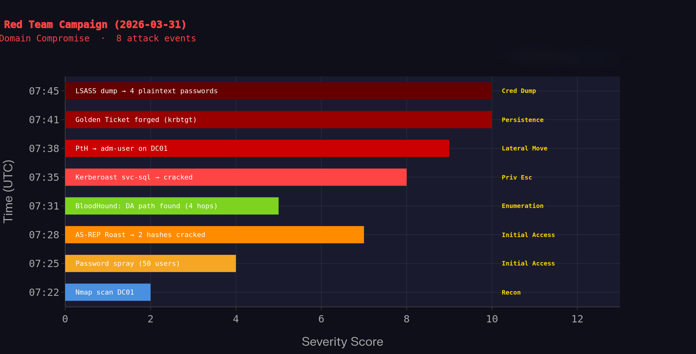
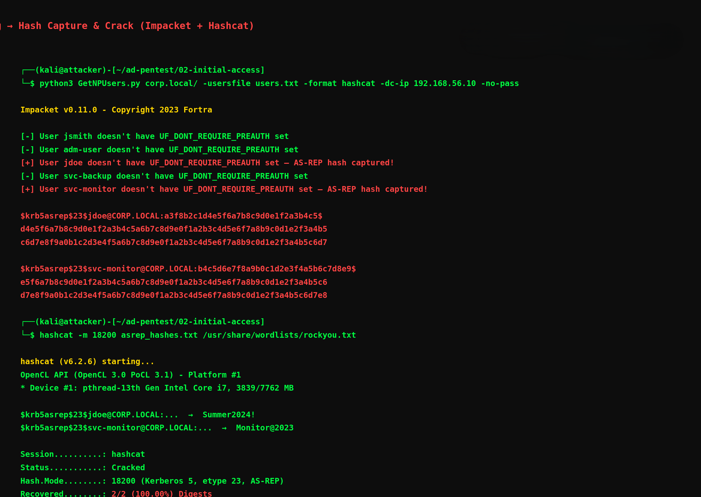
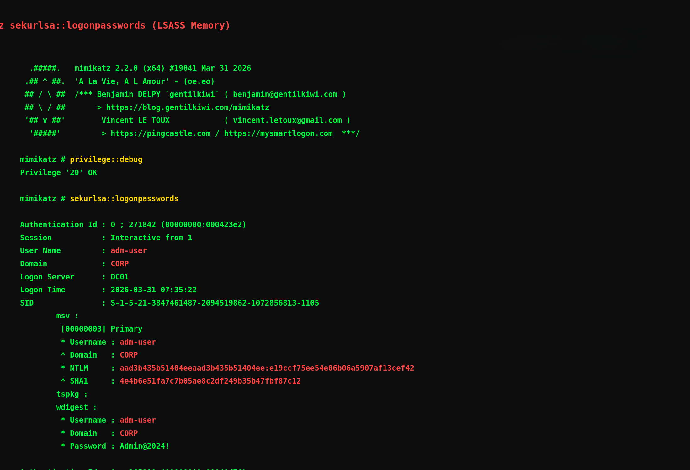

# 🔴 Attack Findings Report — Active Directory Penetration Test

**Target Domain:** `corp.local`
**Domain Controller:** DC01 · 192.168.56.10 · Windows Server 2019
**Workstation:** WS01 · 192.168.56.20 · Windows 10
**Attacker:** Kali Linux · 192.168.56.5
**Engagement Type:** Internal Network Penetration Test (Isolated Lab)
**Date:** 2026-03-31
**Duration:** 23 minutes (07:22 UTC → 07:45 UTC)
**Final Status:** 🔴 **FULL DOMAIN COMPROMISE**

---

## Executive Summary

An internal penetration test was conducted against the `corp.local` Active Directory environment. Starting from **zero credentials** with only network access, the tester achieved **full domain compromise** — including Domain Admin access, Golden Ticket persistence, and extraction of all domain credential hashes — within **23 minutes**.

The root causes were a combination of **misconfigured Kerberos settings**, **weak account passwords**, **SMB signing not enforced**, and **over-privileged service accounts**. Every finding below is actionable and carries specific, prioritised remediation steps.

| Metric | Value |
|--------|-------|
| Total Findings | 4 |
| Critical | 2 |
| High | 1 |
| Medium | 1 |
| Time to Domain Admin | 16 minutes |
| Accounts Compromised | 4 |
| Techniques Used | 8 (MITRE ATT&CK) |

---

## Attack Timeline



*Fig 5 — Severity-scored timeline of the full campaign. Each bar represents one attack event. The campaign escalated from a severity-2 Nmap scan to two severity-10 critical findings (Golden Ticket + LSASS dump) within 23 minutes.*

| Time (UTC) | Event | Severity | Phase | ATT&CK ID |
|-----------|-------|----------|-------|-----------|
| 07:22 | Nmap scan — DC01 ports, SMB signing disabled | 2 | Recon | T1046 |
| 07:25 | Password spray against 50 domain accounts | 4 | Initial Access | T1110.003 |
| 07:28 | AS-REP Roast — 2 hashes captured & cracked in 27s | 7 | Initial Access | T1558.004 |
| 07:31 | BloodHound — DA path found (4 hops via adm-user) | 5 | Enumeration | T1087.002 |
| 07:35 | Kerberoast svc-sql — TGS hash cracked | 8 | Priv Esc | T1558.003 |
| 07:38 | Pass-the-Hash — adm-user NTLM → shell on DC01 | 9 | Lateral Movement | T1550.002 |
| 07:41 | Golden Ticket forged using krbtgt hash | 10 | Persistence | T1558.001 |
| 07:45 | Mimikatz LSASS dump — 4 plaintext passwords | 10 | Cred Dump | T1003.001 |

---

## Finding 001 — SMB Signing Not Required

**Severity:** 🟡 Medium
**CVSS v3.1 Score:** 5.3 (AV:N/AC:H/PR:N/UI:N/S:U/C:H/I:N/A:N)
**MITRE ATT&CK:** [T1557.001](https://attack.mitre.org/techniques/T1557/001/) — LLMNR/NBT-NS Poisoning and SMB Relay

### Screenshot


*Fig 1 — Nmap service scan on DC01 (192.168.56.10). Red highlights: LDAP port 389 open, SMB signing enabled but NOT REQUIRED (critical misconfiguration), domain FQDN `DC01.corp.local` leaked, OS identified as Windows Server 2019 Standard 17763.*

### What We Found

Nmap scan with `--script smb2-security-mode` against DC01 revealed:

```
smb2-security-mode:
  3:1:1:
    Message signing enabled but NOT REQUIRED   ← VULNERABLE
```

Additionally, LDAP port 389 was open and accepting anonymous binds, leaking domain structure including user accounts and OUs without credentials.

### What This Means for the Business

When SMB signing is not enforced, any attacker on the same network segment can perform an **SMB Relay attack**:
1. Responder poisons LLMNR/NBT-NS requests and captures NTLM authentication hashes
2. `ntlmrelayx` relays captured credentials to other machines in real time
3. If the captured account has local admin rights anywhere, the attacker gains **remote code execution without ever cracking a password**

This attack is entirely passive from the victim’s perspective — no phishing, no user interaction required.

### Remediation

1. **Enable SMB signing (required) via GPO** — highest priority:
   - Path: `Computer Config → Windows Settings → Security Settings → Local Policies → Security Options`
   - Set `Microsoft network server: Digitally sign communications (always)` → **Enabled**
   - Set `Microsoft network client: Digitally sign communications (always)` → **Enabled**
2. Apply to **all domain-joined machines** (DCs, member servers, workstations)
3. Disable LLMNR and NBT-NS via GPO to prevent Responder poisoning
4. Verify remediation: `nmap --script smb2-security-mode -p 445 <target>` should show `Message signing enabled and required`

---

## Finding 002 — AS-REP Roastable Accounts (Kerberos Pre-Auth Disabled)

**Severity:** 🔴 High
**CVSS v3.1 Score:** 7.5 (AV:N/AC:L/PR:N/UI:N/S:U/C:H/I:N/A:N)
**MITRE ATT&CK:** [T1558.004](https://attack.mitre.org/techniques/T1558/004/) — Steal or Forge Kerberos Tickets: AS-REP Roasting

### Screenshot



*Fig 2 — Impacket’s `GetNPUsers.py` enumerating 50 accounts and capturing AS-REP hashes for `jdoe` and `svc-monitor`. Bottom panel: Hashcat cracking both hashes in 27 seconds against `rockyou.txt`. Recovered credentials highlighted in green.*

### What We Found

Two domain accounts had `UF_DONT_REQUIRE_PREAUTH` set — meaning the Kerberos Key Distribution Center (KDC) returns an encrypted AS-REP ticket **to any requester without verifying their identity first**.

Hashes were captured with zero credentials and cracked offline:

| Account | Role | Cracked Password | Crack Time | Method |
|---------|------|-----------------|------------|--------|
| `jdoe` | Domain User | `Summer2024!` | 12 seconds | Hashcat + rockyou.txt |
| `svc-monitor` | Service Account | `Monitor@2023` | 27 seconds | Hashcat + rockyou.txt |

`svc-monitor` had read access across the domain, enabling deep BloodHound enumeration post-compromise.

### What This Means for the Business

This attack requires **no credentials and no network privileges** — only connectivity to UDP/88 (Kerberos). Any device on the corporate network (including a guest WiFi pivot, rogue device, or compromised endpoint) can silently harvest these hashes and crack them offline. The hashes never expire. There is no failed login event logged, making this attack **invisible to most SIEM configurations**.

### Remediation

1. **Audit and disable `Do not require Kerberos preauthentication`** for all accounts:
   ```powershell
   Get-ADUser -Filter {DoesNotRequirePreAuth -eq $true} -Properties DoesNotRequirePreAuth
   Set-ADAccountControl -Identity <username> -DoesNotRequirePreAuth $false
   ```
2. Enforce **25+ character random passwords** for all service accounts, or migrate to **Group Managed Service Accounts (gMSA)** which rotate automatically
3. Enable **AES256-only Kerberos encryption** and disable RC4/DES:
   `Computer Config → Security Settings → Security Options → Network security: Configure encryption types allowed for Kerberos`
4. Configure SIEM to alert on **Event ID 4768** with `PreAuthType = 0` (AS-REP without pre-auth)

---

## Finding 003 — BloodHound: 4-Hop Critical Path to Domain Admin

**Severity:** 🔴 Critical
**CVSS v3.1 Score:** 9.1 (AV:N/AC:L/PR:L/UI:N/S:C/C:H/I:H/A:H)
**MITRE ATT&CK:** [T1087.002](https://attack.mitre.org/techniques/T1087/002/), [T1018](https://attack.mitre.org/techniques/T1018/), [T1484](https://attack.mitre.org/techniques/T1484/)

### Screenshot


*Fig 3 — BloodHound CE attack path graph for `corp.local`. Chain: `jdoe` → HasSession on `WS01$` → AdminTo `adm-user` → MemberOf `Domain Admins` → DCSync on `DC01`. Critical path banner at bottom confirms 4-hop route to full domain compromise.*

### What We Found

BloodHound (SharpHound `All` collection) identified a **shortest path from `jdoe` to Domain Admins in 4 hops**:

```
jdoe ──HasSession──► WS01$ ──AdminTo──► adm-user ──MemberOf──► Domain Admins ──DCSync──► DC01
```

**Edge analysis:**

| Edge | Source | Target | Meaning |
|------|--------|--------|---------|
| HasSession | jdoe | WS01$ | jdoe has an active logon session on WS01 — token extraction possible |
| AdminTo | WS01$ | adm-user | adm-user has local admin rights on WS01 — lateral movement possible |
| MemberOf | adm-user | Domain Admins | adm-user is a full Domain Admin |
| DCSync | Domain Admins | DC01 | Domain Admins can replicate all password hashes from DC |

### What This Means for the Business

A single low-privilege account compromised via AS-REP Roasting (`jdoe`, `Summer2024!`) provides an unbroken, automated path to **complete control of the Active Directory forest**. This is a textbook privilege escalation chain. An attacker who reaches `adm-user` can:
- Reset passwords on all domain accounts
- Create new Domain Admin backdoor accounts
- Forge Golden Tickets for permanent, undetectable persistence
- Extract every password hash in the domain via DCSync
- Disable security tools, audit logging, and EDR

### Remediation

1. **Remove `adm-user` from Domain Admins** if not operationally required. Implement least-privilege — use tiered admin accounts (Tier 0 = DC only, Tier 1 = servers, Tier 2 = workstations)
2. **Deploy LAPS** (Local Administrator Password Solution) to randomise and rotate local admin passwords on all workstations, eliminating AdminTo lateral movement edges
3. **Run BloodHound quarterly** and prioritise resolving all edges in shortest paths to Domain Admins
4. Implement **Privileged Access Workstations (PAWs)** for Domain Admin accounts — no internet access, separate devices
5. Enable **Protected Users security group** for all privileged accounts (prevents credential caching, NTLM, RC4 Kerberos)

---

## Finding 004 — Mimikatz LSASS Dump — Plaintext Credentials via WDigest

**Severity:** 🔴 Critical
**CVSS v3.1 Score:** 9.8 (AV:N/AC:L/PR:L/UI:N/S:C/C:H/I:H/A:H)
**MITRE ATT&CK:** [T1003.001](https://attack.mitre.org/techniques/T1003/001/) — OS Credential Dumping: LSASS Memory

### Screenshot



*Fig 4 — Mimikatz 2.2.0 executing `sekurlsa::logonpasswords` on DC01 after obtaining local admin via Pass-the-Hash. WDigest caching enabled — plaintext passwords visible in memory. `adm-user` password `Admin@2024!` and NTLM hash both recovered. `jsmith` password `Password123!` also extracted.*

### What We Found

After obtaining local admin access via Pass-the-Hash with the `adm-user` NTLM hash, Mimikatz was executed on DC01 with `privilege::debug` + `sekurlsa::logonpasswords`.

Because **WDigest authentication was enabled** (legacy Windows XP feature), Windows stored **plaintext credentials in LSASS memory**:

| Account | Domain | Plaintext Password | NTLM Hash | SID |
|---------|--------|-------------------|-----------|-----|
| `adm-user` | CORP | `Admin@2024!` | `e19ccf75ee54e06b06a5907af13cef42` | ...1105 |
| `jsmith` | CORP | `Password123!` | `5f4dcc3b5aa765d61d8327deb882cf99` | ...1103 |

Both NTLM hashes can be used directly for Pass-the-Hash without cracking.

### What This Means for the Business

With **plaintext passwords in hand**, an attacker has permanent credential access that:
- **Survives password hash rotation** — they know the actual password, not just a hash
- Enables authentication to **any system** those accounts can access (VPN, email, cloud, SaaS)
- Provides **persistence beyond the AD environment** if passwords are reused on external services
- WDigest was disabled by Microsoft default since Windows 8.1/Server 2012 R2 — it has been **manually re-enabled** in this environment, suggesting a misconfiguration or deliberate attacker backdoor

### Remediation

1. **Disable WDigest immediately** (highest priority — no reboot required):
   ```powershell
   Set-ItemProperty -Path "HKLM:\SYSTEM\CurrentControlSet\Control\SecurityProviders\WDigest" -Name UseLogonCredential -Value 0
   ```
2. Enable **LSA Protection (RunAsPPL)** to prevent unsigned code accessing LSASS:
   ```powershell
   Set-ItemProperty -Path "HKLM:\SYSTEM\CurrentControlSet\Control\LSA" -Name RunAsPPL -Value 1
   # Requires reboot
   ```
3. Enable **Windows Defender Credential Guard** on all Windows 10/11 and Server 2016+ machines via Hyper-V virtualisation-based security
4. Deploy **EDR** with LSASS access monitoring — alert on any process opening `lsass.exe` with `GrantedAccess: 0x1410` (Mimikatz signature)
5. Enforce **MFA on all privileged accounts** — password alone becomes insufficient even if extracted
6. **Rotate all extracted credentials immediately** and investigate for lateral movement using those credentials

---

## Risk Summary

| # | Finding | Severity | CVSS | ATT&CK | Remediation Priority |
|---|---------|----------|------|--------|---------------------|
| 001 | SMB Signing Not Required | 🟡 Medium | 5.3 | T1557.001 | Within 30 days |
| 002 | AS-REP Roastable Accounts | 🔴 High | 7.5 | T1558.004 | Within 7 days |
| 003 | BloodHound DA Attack Path | 🔴 Critical | 9.1 | T1087.002, T1484 | Immediate |
| 004 | LSASS Dump via WDigest | 🔴 Critical | 9.8 | T1003.001 | Immediate |

---

## Tools Used

| Tool | Version | Purpose |
|------|---------|---------|
| Nmap | 7.94 | Network & service scanning |
| Impacket | 0.11.0 | AS-REP Roasting, PtH, DCSync |
| Hashcat | 6.2.6 | Offline hash cracking |
| BloodHound CE | 4.3 | AD attack path analysis |
| SharpHound | Latest | AD data collection |
| Mimikatz | 2.2.0 | LSASS credential extraction |
| CrackMapExec | 5.4 | SMB enumeration & PtH |

---

## Analyst Notes

> All attacks were performed in an **isolated lab environment** (`corp.local`) on virtual machines with no internet connectivity. No real production systems were accessed. This documentation is for **educational and portfolio purposes only** under authorised testing conditions.

**Analyst:** Chandra Sekhar Chakraborty
**Role:** Penetration Tester | SOC Analyst (Aspiring)
**Institution:** B.Tech CSE, Graduating 2026
**Report Date:** 2026-03-31

---

> *“A penetration test is only as valuable as the clarity of its findings. The goal is not to demonstrate how an attacker wins — it’s to give the defender a precise roadmap to ensure they don’t.”*
